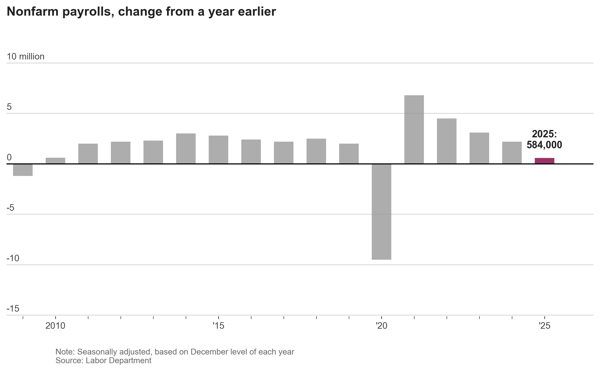

# Matplotlib Recreation: Nonfarm Payrolls Chart

This repository contains Python code to replicate a Wall Street Journal-style chart using `matplotlib`.

## The Output



## Usage

To generate the chart yourself, run:

```bash
python payroll_chart.py
